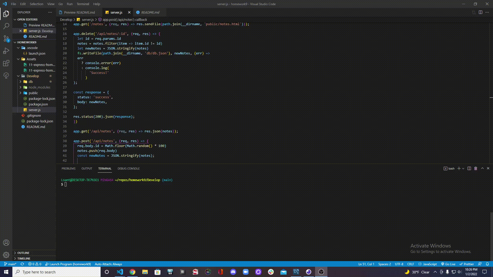
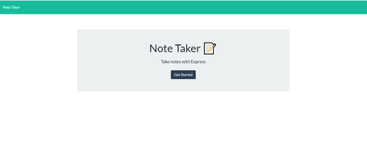
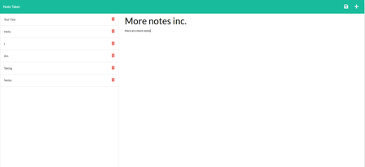

# Note Taker 
https://wingz003.github.io/Notetaker-o-Luigi/

# Description
This is a Note Taker for the SMU coding bootcamp. Its framework utilizes express.js to **save**, **retreive** and **delete** note data from a JSON file.

[

# Table of Contents
* [Installation](#installation)
* [Usage](#usage)
* [Contributions](#contributions)
* [Questions](#questions)

## Installation
### You will need to install the following dependencies prior to running the application: 

Express

## Usage 
### Below are the following steps required to run this application: 

1. After routing has been established, you will have to run node server.js to establish connection to the server.

2. You will then look up your localhost on your webpage and be directed to a page with a start button.

2. After pressing the start button. You will then be introduced with a note taker with multiple functionalities.

3. You will be able to **save**, **retreive** and **delete** notes at a whim!

## Contributions 

No contributions have been made.

## Questions
### If you have a questions or concerns, feel free to contact me at Lsanti618@gmail.com.
